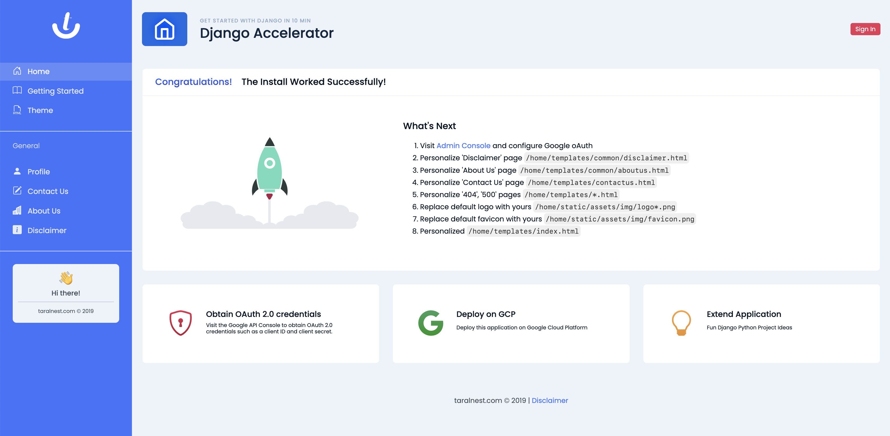

# agi-publisher

Primary goal of `agi-publisher` is to leverage LLM as team of AGI working together to develop publishcation ready content.



## Get Started
1. Create project

```
mkdir myproject
cd myproject
git clone https://github.com/code-poineer/agi-publisher.git .
```

2. Create Virtual Environment
```
python -m venv venv
source venv/bin/activate
```

3. Install packages
```
pip install --upgrade pip
pip install -r requirements.txt
brew install redis
```

4. Setup database
```
python manage.py migrate
```

5. Setup admin account
```
python manage.py createsuperuser
```

6. Run Unit Test Case
```
python manage.py test
```

7. Start Redis server
```
redis-server
```

8. Start task worker
```
python manage.py runworker blog_create_channel
```

9. Start server
```
python manage.py runserver --insecure
```